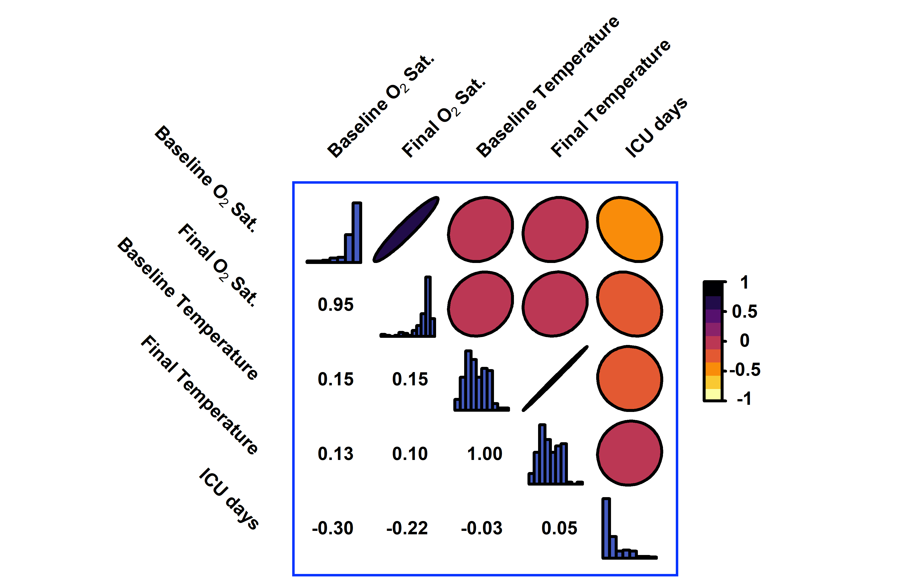

## Data Visualization

This data visualization (dataviz) infographics presents six plots based on COVID-19 data from hospitalized patients during the pandemic Spanish first wave. Each graphic explores different statistical concepts.

### Balloon plot

#### **How diagnostic and status were related?**

This Balloon plot is acontingency table for the frequency of the different diagnostics and the status,individually and jointly.

### Rose diagram

**Among the total number of COVID-19 hospitalizations per day during March-Abril 2020 what was the proportion of women?**

The **Coxcomb** or **Rose diagram** was designed by Florence Nightingale. This plot is a variation of a pie chart highlighting the evolution of COVID19 hospitalizations during March and April of 2020. The area of a section represents the value of the corresponding category. This current plot allows us to visualize i) the total number of hospitalizations per day and ii) the proportion of hospitalized women.

### Barplot

**Is the length of ICU stay related to the patient’s age?**

This barplot shows that there is no relation between the length of ICU stay and the age

### Correlation plot

**What is the relationship between patient characteristics, such as oxygen saturation, temperature and days in the ICU?**

The **Correlation plot** represents associations between factors through ellipses. An ellipse close to a circumference indicates lack of relationship, while ellipses more elongated indicate a direct relationship if they grow to the right or an inverse relationship otherwise. In this plot two measurements of $O_2$ Sats at different times were highly correlated (direct relationship). In turn, these saturations were moderately inversely related to the days in ICU (thehigher the saturation, the fewer days in the ICU)

### Calendar plot

**How were hospitalizations temporarily distributed?**

Calendar plot represents an indicator over time using a color scale associating more intense colors with larger magnitudes. On March 14th, 2020, the lockdown began in Spain. The plot represents the number of hospitalizations in HM hospitals by fortnight, weekday and time slot. There was a rebound in hospitalizations in the first fortnight post-confinement that was reversed in the subsequent fortnight. The time slots with the highest number of hospitalizations were located between noon and 10pm.  and there were slightly fewer hospitalizations on weekends. In the worst scenario, more than 25 hospitalizations were recorded every 2 hours, that is, one every 5 minutes.

### Sankey Diagram

**How do patients move through several states after hospitalization?**

**Sankey Diagram** visualizes the number of individuals that move from one state to another in a fixed period of time. The width of the flows is proportional to the number of individuals that pass through it. In this diagram, and over a 2-month period during the first wave of the COVID-19 pandemic, there was a higher percentage of patients who were discharged among those who did not enter the ICU (78%, 1538 out of 1964) than among those who did enter (38%, 78 out of 203).

